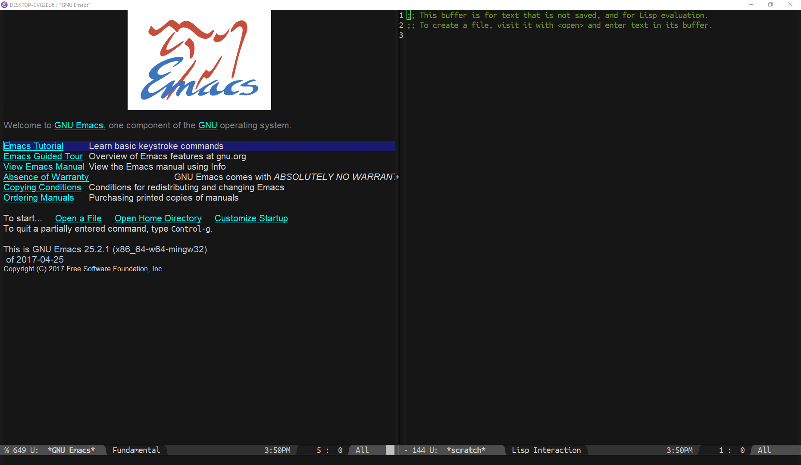
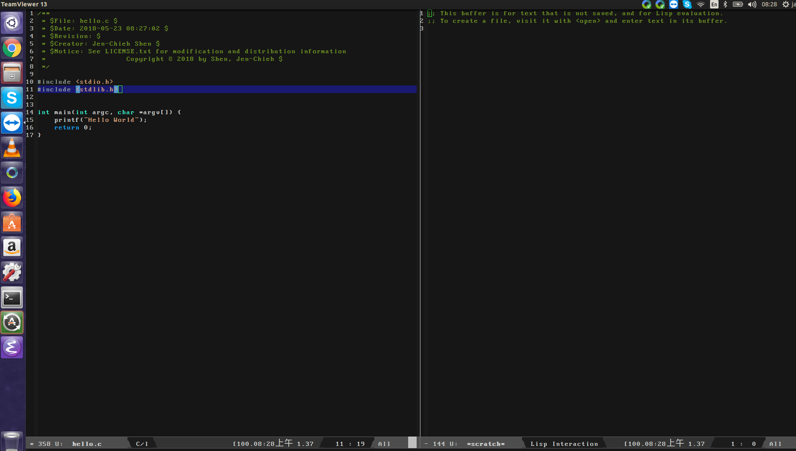
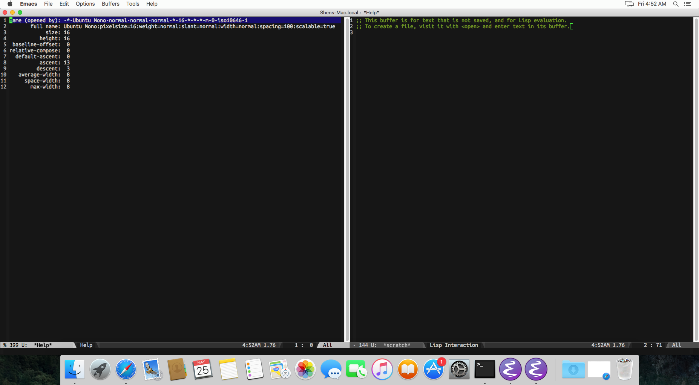

[](https://travis-ci.com/jcs090218/use-ttf)
[](https://melpa.org/#/use-ttf)
[](https://www.gnu.org/licenses/gpl-3.0)


# use-ttf
> Ensure Emacs' font consistency across different OSs.

| Windows 10 / Ubuntu Mono Regular                 | Ubuntu 14 / Classic Console                             | Mac OS / Ubuntu Mono Regular                     |
|:------------------------------------------------:|:-------------------------------------------------------:|:------------------------------------------------:|
||||


## Who may need this?
I created this for people who have problems with their fonts not working 
over different OS’s due to different installation methods used in different 
OS’s. The purpose of this package is to automatically install font files (.ttf) 
based on the OS you’re using. Saving you time from manually installing fonts.


## Configuration
List of TTF fonts you want to use and install in the currnet OS.
```el
;; I just have all my fonts inside my '.emacs.d' directory for sake of simplicity.
;; But you can have your font at any directory you want.
(setq use-ttf-default-ttf-fonts '(;; >> Classic Console <<
                                  "/.emacs.jcs/fonts/clacon.ttf"
                                  ;; >> Ubuntu Mono <<
                                  "/.emacs.jcs/fonts/UbuntuMono-R.ttf"))
```

Name of the font you want to use as default. I choose Ubuntu Mono as my 
default font.
```el
(setq use-ttf-default-ttf-font-name "Ubuntu Mono")
```

## Usage
Install fonts into the current OS. The more .ttf file you try to install might
take a while, but this function does not block the Emacs' process itself.
Furthermore, you will want to call `use-ttf-set-default-font` function after
install all the fonts in the `use-ttf-default-ttf-fonts` list.
```el
M-x use-ttf-install-fonts
```

Use the font by `use-ttf-default-ttf-font-name` variable. This will actually
set your Emacs to your target font.
```el
M-x use-ttf-set-default-font
```


## Contribution
If you would like to contribute to this project, you may either 
clone and make pull requests to this repository. Or you can 
clone the project and establish your own branch of this tool. 
Any methods are welcome!
