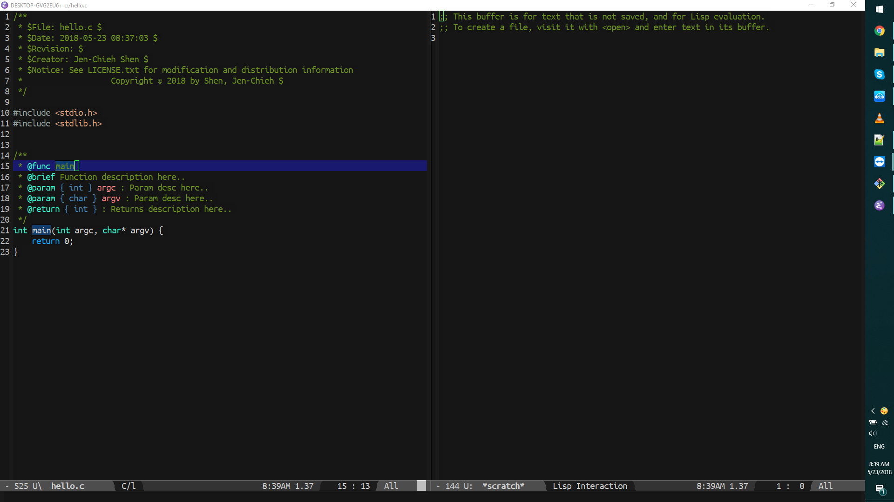

[](https://www.gnu.org/licenses/gpl-3.0)
[](https://melpa.org/#/use-ttf)
[](https://stable.melpa.org/#/use-ttf)

# use-ttf
> Keep font consistency across different OSs.

[](https://github.com/jcs-elpa/use-ttf/actions/workflows/test.yml)

I created this for people who have problems with their fonts not working
over different OS’s due to different installation methods used in different
OS’s. The purpose of this package is to automatically install font files (.ttf)
based on the OS you’re using. Saving you time from manually installing fonts.

| Windows 10 / Ubuntu Mono                  | Ubuntu 14 / Classic Console                      | Mac OS / Ubuntu Mono                      |
|------------------------------------------:|:------------------------------------------------:|:-----------------------------------------:|
||||


**:exclamation::exclamation: [ATTENTION] :exclamation::exclamation:
-- MAKE SURE EMACS HAS THE PERMISSION TO INSTALL FONTS!**

## Configuration

List of TTF fonts you want to use and install in the currnet OS.
```el
;; I just have all my fonts inside my '.emacs.d' directory for sake of simplicity.
;; But you can have your font at any directory you want.
(setq use-ttf-default-ttf-fonts '(;; >> Classic Console <<
                                  "~/.emacs.d/fonts/clacon.ttf"
                                  ;; >> Ubuntu Mono <<
                                  "~/.emacs.d/fonts/UbuntuMono-R.ttf"))
```

Name of the font you want to use as default. I choose `Ubuntu Mono` as my
default font.
```el
(setq use-ttf-default-ttf-font-name "Ubuntu Mono")
```

## Usage

Install fonts into the current OS. The more .ttf file you try to install might
take a while, but this function does not block the Emacs' process itself.
Furthermore, you will want to call `use-ttf-set-default-font` function after
install all the fonts in the `use-ttf-default-ttf-fonts` list.
```el
M-x use-ttf-install-fonts
```

Use the font by `use-ttf-default-ttf-font-name` variable. This will actually
set your Emacs to your target font.
```el
M-x use-ttf-set-default-font
```

## Contribute

[](http://makeapullrequest.com)
[](https://github.com/bbatsov/emacs-lisp-style-guide)
[](https://www.paypal.me/jcs090218)

If you would like to contribute to this project, you may either
clone and make pull requests to this repository. Or you can
clone the project and establish your own branch of this tool.
Any methods are welcome!
